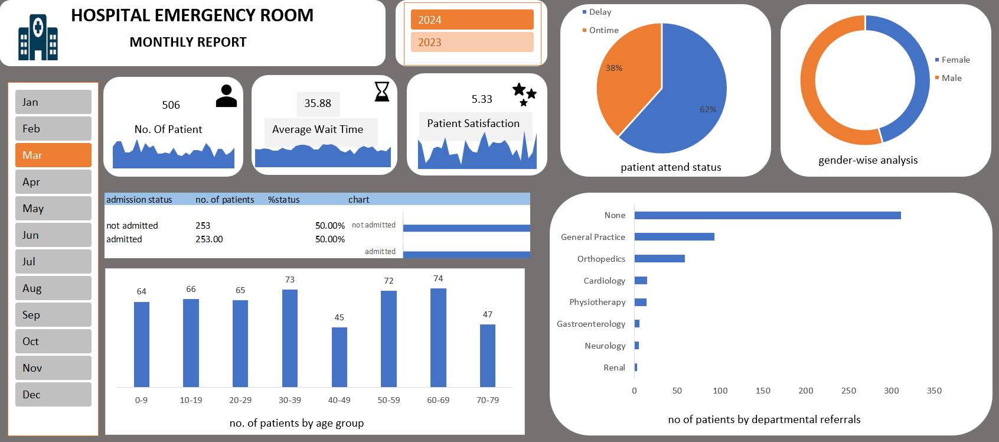

# 🏥 Hospital Emergency Room Analysis Dashboard

## 📌 Project Overview

This project analyzes **Hospital Emergency Room patient data using Microsoft Excel** to identify patterns in patient visits, waiting times, admissions, satisfaction scores, demographics, and departmental referrals.

An interactive Excel dashboard was created to transform raw patient data into meaningful insights that can support hospital operations and decision-making.

## 🎯 Business Objective

The objective of this project is to:

* Analyze overall Emergency Room patient volume
* Understand patient admission and non-admission trends
* Analyze average patient waiting time
* Evaluate patient satisfaction scores
* Identify trends in daily patient visits
* Analyze patient demographics
* Examine departmental referrals
* Present key findings through an interactive dashboard

## 🛠️ Tools & Skills

* **Microsoft Excel**
* Data Cleaning & Preparation
* Pivot Tables
* Pivot Charts
* Data Analysis
* Conditional Formatting
* Dashboard Development
* KPI Analysis
* Data Visualization

## 📊 Dashboard

The dashboard provides an overview of key Emergency Room performance indicators, including:

* Total Patients
* Average Waiting Time
* Patient Satisfaction
* Admission Status
* Patient Demographics
* Department Referrals
* Daily Patient Visits

## 🔍 Key Analysis

The project includes analysis of:

### Patient Visits

Analyzed patient volume and daily visit patterns to identify periods of higher and lower Emergency Room activity.

### Waiting Time

Calculated and analyzed patient waiting times to understand the efficiency of Emergency Room operations.

### Admission Analysis

Compared admitted and non-admitted patients to understand admission patterns.

### Patient Satisfaction

Analyzed satisfaction scores to understand the relationship between Emergency Room service experience and patient outcomes.

### Demographics

Analyzed patient information across demographic categories to identify patterns in Emergency Room utilization.

### Department Referrals

Examined referrals to different hospital departments to understand where patients were directed after Emergency Room visits.

## 💡 Key Insights

The analysis helps identify:

* Trends in Emergency Room patient volume
* Patterns in patient waiting times
* Admission and non-admission distribution
* Variations in patient satisfaction
* Demographic patterns among ER patients
* Departments receiving the highest number of referrals
* Daily fluctuations in Emergency Room visits

## 📁 Project Files

| File                                     | Description                           |
| ---------------------------------------- | ------------------------------------- |
| `Hospital_Emergency_Room_Dashboard.xlsx` | Complete Excel dashboard and analysis |
| `Hospital_Emergency_Room_Data.csv`       | Raw dataset used for the analysis     |
| `dashboard.png`                   | Dashboard preview                     |

## 🚀 Skills Demonstrated

This project demonstrates practical skills in:

**Excel → Data Cleaning → Pivot Tables → Data Analysis → Visualization → Dashboard Development → Business Insights**

## 👩‍💻 Author

**Kalyani**

Aspiring Data Analyst with hands-on experience in Excel, SQL, Python, and Power BI.
